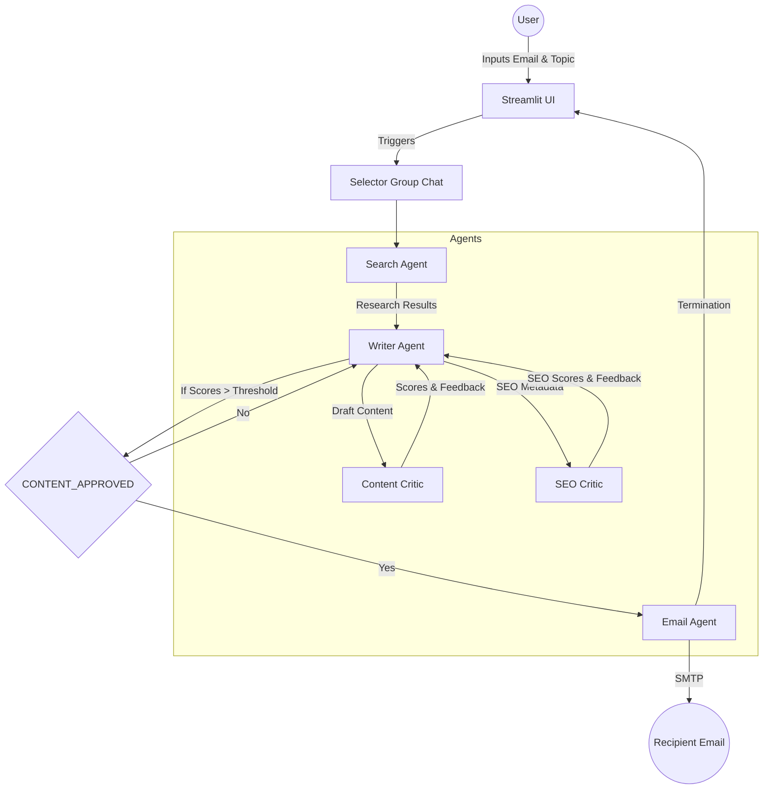

# 🤖 AGENTIC CONTENT WRITER - End-to-End System

An advanced AI-powered content creation platform using **AutoGen AgentChat** and **Streamlit**. The system coordinates a team of specialized agents to research, write, critique, and deliver high-quality SEO-optimized content directly to your email.

## 🏗️ Architectural Workflow



## 🚀 End-to-End Task & Plan

### Phase 1: Research & Discovery
- **User Action**: Enters topic (e.g., "AI in ERP") and Email Address in the UI.
- **Search Agent**: Utilizes **SerpApi** to fetch the latest organic search results from Google, ensuring content freshness and factual relevance.

### Phase 2: Content Generation
- **Writer Agent**: Processes search findings to draft a professional markdown article.
- **Output**: Generates both the main content and a dedicated "SEO Content" block (Title, Meta Description, Keywords).

### Phase 3: Recursive Critique & Optimization
- **Content Critic**: Evaluates Grammar, Clarity, Style, Originality, and Value on a **0-100 scale**.
- **SEO Critic**: Evaluates SEO best practices and extracts meta-parameters.
- **Iterative Loop**: The Writer Agent automatically addresses feedback and improves the draft until the **Minimum Score Threshold** (e.g., 90/100) is met.

### Phase 4: Delivery & Termination
- **Validation**: Once the critics are satisfied, the Writer signals `CONTENT_APPROVED`.
- **Email Agent**: Retrieves the final draft and sends it to the user's provided email via SMTP (Gmail).
- **Regenerate**: The user can adjust the score threshold via Streamlit and trigger a "Regenerate" to improve the quality further.

---

## 🛠️ Step-by-Step Setup

1. **Install Requirements**:
   ```bash
   pip install streamlit autogen-agentchat autogen-ext google-search-results python-dotenv
   ```

2. **Configure Environment (`.env`)**:
   Create a `.env` file in the root directory:
   ```env
   # OpenAI Config
   OPENAI_API_KEY=sk-...
   OPENAI_MODEL_NAME=gpt-4.1-nano
   
   # Search Config
   SERPAPI_API_KEY=...
   
   # Email Config (Gmail Example)
   SENDER_EMAIL=your-bot-email@gmail.com
   SENDER_PASSWORD=your-app-password
   ```

3. **Launch Application**:
   ```bash
   streamlit run app.py
   ```

## ⚙️ Core Components
- **Framework**: AutoGen AgentChat (Python)
- **UI**: Streamlit
- **LLM**: OpenAI GPT models
- **Search**: SerpApi (Google Search)
- **SMTP**: Python `smtplib` (SSL/TLS)